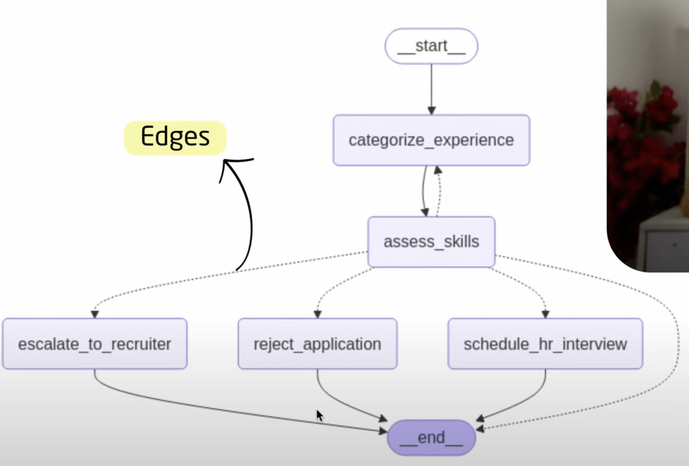

# lang-graph

langgraph uses graph based approach to handle complex and dynamic workflows for building LLM based apps

what we are building ???
- categorize applications and perform various operations on them
- based on various parameters it will assess and it will match the application to the operations
- the mis-match will be rejected 
- unable to find the match will be sent to recruiter 
- the match will be sent to the hr interviewer

what are components of a graph?
- state --> data structure that represents the current snapshot of the application can be python type but is typically a typedict or pydantic basemodel
- nodes --> functions that contains the logic to perform the operation, they recieve the current state and perform the operation and return the computed state
- edges --> functions that determine the next to execute based on the current state , they can be conditional branches or transitions

--- in a workflow the state can be only one that is modified as the workflow progresses through different nodes 

--- to add nodes use .add_node
